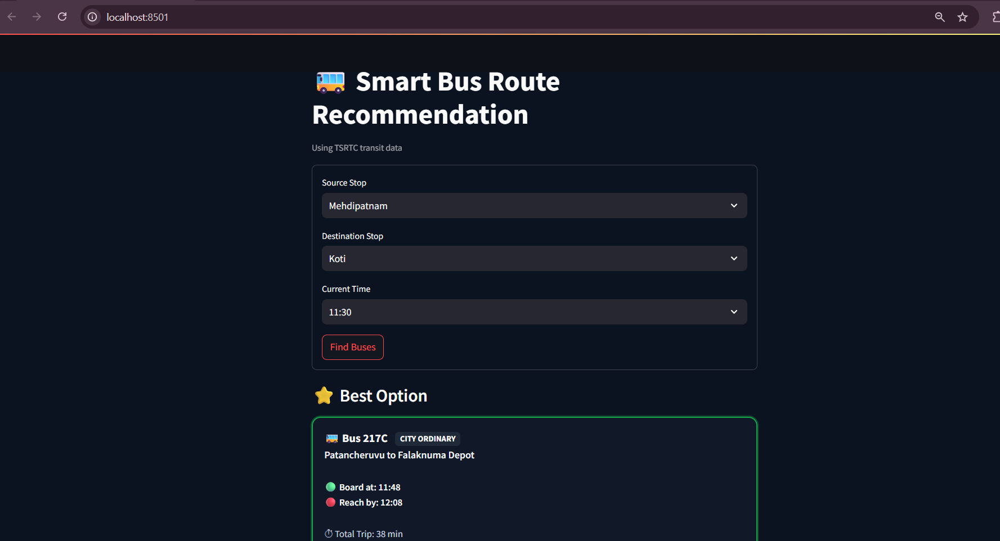

# 🚌 Smart Bus Route Recommendation System

An interactive transit planning application that recommends the **best bus between two stops** using schedule data.
The system evaluates available trips and suggests the optimal option based on **waiting time, travel duration, and total journey time**.

This project demonstrates how transportation schedule data can be transformed into an **intelligent, data-driven decision support tool**.

---

## 🚀 Overview

Public transport systems publish schedule datasets, but turning those schedules into useful journey recommendations requires efficient querying and route evaluation.

This application:

* Finds buses connecting a **source stop** and **destination stop**
* Calculates **wait time, travel time, and total journey duration**
* Highlights the **best available bus**
* Displays alternative options for comparison

The user interface is built with **Streamlit**, providing a lightweight interactive transit planner.

---

## ✨ Features

✅ Bus recommendation based on **minimum total journey time**
✅ Calculates **wait time, travel time, and number of stops**
✅ Efficient lookup using **trip and stop indexing**
✅ Interactive UI built with **Streamlit**
✅ Uses schedule data in **GTFS format**

---

## 📊 Data Source

Transit schedule data originates from the open data initiative of
Telangana State Road Transport Corporation.

Official portal:

https://www.tgsrtc.telangana.gov.in/open-data

To access the datasets, users must **submit a request form on the portal**. After approval, the following GTFS files can be downloaded:

* `agency.csv`
* `calendar.csv`
* `routes.csv`
* `trips.csv`
* `stop_times.csv`
* `stops.csv`

These raw files are **not included in this repository** to respect the provider's data distribution policy.

---

## 📂 Dataset in This Repository

This repository includes a **derived dataset**:

```
full_data.csv
```

This file was generated by preprocessing and combining the GTFS schedule tables to enable **faster route queries inside the application**.

If you want to recreate the dataset, download the original GTFS files from the TGSRTC open data portal and run the preprocessing workflow.

---

## 🧠 How the Algorithm Works

To avoid expensive full-table scans during every query, the system builds two lookup structures:

### Stop Index

```
stop_name → rows containing that stop
```

### Trip Index

```
trip_id → ordered stops belonging to the trip
```

The algorithm:

1️⃣ Find trips that pass through the **source stop**
2️⃣ Check if the **destination stop appears later in the trip**
3️⃣ Compute **wait time and travel duration**
4️⃣ Rank candidate trips by **total journey time**

This approach significantly improves search efficiency compared to repeated dataframe joins.

---

## 🖥️ Project Structure

```
Smart_bus_route_recommendation
│
├── app.py
├── data_analysis.R
├── full_data.csv
└── README.md
```

* **app.py** – Streamlit application
* **data_analysis.R** – data preprocessing workflow
* **full_data.csv** – processed dataset used by the app

---

## ⚙️ Running the Application

Install dependencies:

```
pip install streamlit pandas
```

Run the app:

```
streamlit run app.py
```

Open the browser:

```
http://localhost:8501
```

---

## 📷 Application Screenshots

*(Example UI outputs)*

You can add screenshots of:

* Bus search interface


* Alternative bus options
  !{other options](images/other_option.png)
---

## 🛠 Tech Stack

🐍 Python
📊 Pandas
🖥 Streamlit
🚌 GTFS Transit Data

---

## 👩‍💻 Author

**Akshitha Mothkur**

AI/ML enthusiast interested in building **intelligent data-driven applications** that transform raw datasets into practical systems.
